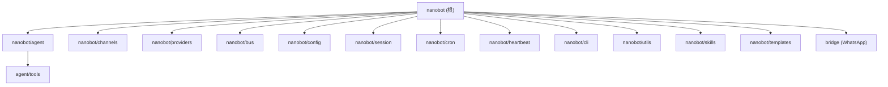

# nanobot - 个人 AI 助手

> 多渠道、可扩展的个人 AI 助手框架，支持 Telegram、Discord、WhatsApp、飞书、钉钉、Matrix、Slack、QQ、Email 等消息平台，通过 LLM 实现智能对话与工具调用。

## 项目愿景

nanobot 是一个开源的多渠道 AI 助手后端，目标是让用户通过任意即时通讯平台与 AI 助手交互。核心设计理念：

- **多渠道统一**：一个 Agent 同时服务多个消息平台
- **工具驱动**：Agent 通过 Tool Calling 执行 Shell 命令、文件操作、Web 搜索等
- **可扩展**：通过 Skill 系统和 MCP 协议扩展能力
- **记忆持久化**：会话历史 + 长期记忆 + 定时任务

## 架构总览

nanobot 采用消息总线 (MessageBus) 驱动的事件架构：

1. **消息入站**：各 Channel 接收用户消息，发布到 MessageBus
2. **Agent 处理**：AgentLoop 从 Bus 获取消息，构建上下文，调用 LLM
3. **工具执行**：LLM 返回 Tool Call，AgentLoop 执行并将结果回传 LLM
4. **消息出站**：最终响应通过 MessageBus 路由到对应 Channel 发送

```
User <-> Channel (Telegram/Discord/...) <-> MessageBus <-> AgentLoop <-> LLM Provider
                                                              |
                                                     ToolRegistry (exec, web, file, cron, spawn, mcp...)
```

## 模块结构图



## 模块索引

| 模块 | 路径 | 语言 | 职责 |
|------|------|------|------|
| agent | `nanobot/agent/` | Python | 核心 Agent 循环、上下文构建、记忆、技能、子代理 |
| agent/tools | `nanobot/agent/tools/` | Python | 工具注册中心与所有内置工具实现 |
| channels | `nanobot/channels/` | Python | 消息渠道适配器 (Telegram, Discord, WhatsApp, 飞书, 钉钉, Matrix, Slack, QQ, Email) |
| providers | `nanobot/providers/` | Python | LLM 提供者 (LiteLLM 多后端, Azure OpenAI, OpenAI Codex, Custom, 语音转写) |
| bus | `nanobot/bus/` | Python | 消息总线与事件定义 |
| config | `nanobot/config/` | Python | 配置 Schema (Pydantic)、加载器、路径管理 |
| session | `nanobot/session/` | Python | 会话管理 (JSONL 持久化) |
| cron | `nanobot/cron/` | Python | 定时任务调度服务 |
| heartbeat | `nanobot/heartbeat/` | Python | 周期性心跳唤醒服务 |
| cli | `nanobot/cli/` | Python | CLI 命令 (Typer): onboard, agent, gateway, chat |
| utils | `nanobot/utils/` | Python | 工具函数 (文件、时间戳、消息分割) |
| skills | `nanobot/skills/` | Markdown/YAML | 内置技能 (GitHub, Weather, Summarize, Tmux, ClawHub, Skill-Creator) |
| templates | `nanobot/templates/` | Markdown | 工作区模板文件 (AGENTS.md, SOUL.md 等) |
| bridge | `bridge/` | TypeScript | WhatsApp Node.js 桥接器 (Baileys) |

## 运行与开发

### 安装

```bash
# 从 PyPI 安装
pip install nanobot-ai

# 从源码开发安装
pip install -e ".[dev]"
```

### 主要命令

```bash
# 初始化设置
nanobot onboard

# 单次对话
nanobot agent -m "你好"

# 交互式聊天
nanobot chat

# 启动多渠道网关
nanobot gateway

# 查看版本
nanobot version
```

### 配置

配置文件位于 `~/.nanobot/config.json`，支持 camelCase 和 snake_case，使用 Pydantic 做 Schema 校验。主要配置项：

- `agents.defaults.model` - 默认 LLM 模型
- `agents.defaults.apiKey` - API 密钥
- `channels.*` - 各渠道配置 (token, allowFrom 等)
- `tools.*` - 工具配置 (Brave API key, MCP 服务器等)

### 测试

```bash
# 运行测试
pytest

# 运行特定测试
pytest tests/test_commands.py -v
```

### Docker

```bash
docker-compose up -d
```

## 测试策略

- 测试框架：**pytest**
- 测试目录：`tests/`
- 当前测试覆盖范围：CLI 命令、频道适配器、Agent 循环、Cron 服务、心跳服务、MCP 工具、消息工具、配置路径等
- 共 22 个测试文件

## 编码规范

- Python >= 3.11，使用类型标注 (`str | None` 新式语法)
- 配置层使用 Pydantic BaseModel + pydantic-settings
- 异步优先 (asyncio)，所有 I/O 操作使用 async/await
- 日志使用 loguru
- CLI 使用 Typer + Rich
- HTTP 客户端使用 httpx
- 配置支持 camelCase/snake_case 双向兼容 (alias_generator=to_camel)

## AI 使用指引

### 关键入口

- CLI 入口：`nanobot/cli/commands.py`
- Agent 循环：`nanobot/agent/loop.py`
- 上下文构建：`nanobot/agent/context.py`
- 配置 Schema：`nanobot/config/schema.py`
- 提供者注册：`nanobot/providers/registry.py`

### 常见开发任务

- **新增渠道**：在 `nanobot/channels/` 下新建文件，继承 `BaseChannel`，在 `manager.py` 中注册
- **新增工具**：在 `nanobot/agent/tools/` 下新建文件，继承 `Tool`，在 `AgentLoop.__init__` 中注册
- **新增 LLM 提供者**：在 `nanobot/providers/` 下新建文件，继承 `LLMProvider`，在 `registry.py` 中注册
- **新增技能**：在 `nanobot/skills/` 或工作区 `skills/` 目录创建 `SKILL.md` (YAML frontmatter + 指令)

### 安全注意事项

- API 密钥存储在 `~/.nanobot/config.json`，需设置 `chmod 600`
- `exec` 工具有危险命令模式过滤 (deny_patterns)
- 文件操作有路径遍历保护
- 各渠道通过 `allowFrom` 白名单控制访问
- 详见 `SECURITY.md`

## 变更记录 (Changelog)

| 日期 | 操作 | 说明 |
|------|------|------|
| 2026-03-09 | 创建 | 初次生成 CLAUDE.md，覆盖全部模块扫描 |
